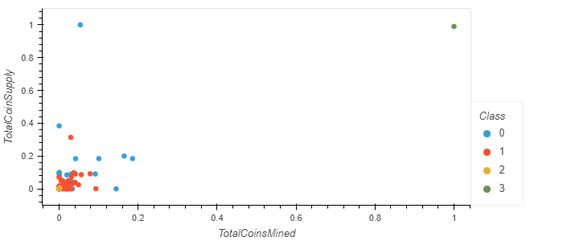

# Cryptocurrencies

## Overview of Project
Uses a K-Means Clustering unsupervised learning model to cluster cryptocurrency data using the following features: the encrypting algorithm used for the currency, the currency's proof type, the total cryptocurrency supply and the total cryptocurrency mined. Only currencies that are both currently being traded and have actually been mined were used in analysis; after filtering the data with these conditions in mind, the data was prepared by encoding the categorical data and then standardized to be ready for use with the K-Means model.

As the dataset had many dimensions, principal component analysis was used to reduce the dimensionality down to 3 principal components. An elbow curve was generated to determine the best amount of clusters to classify data into: 4 clusters.

## Results

The four clusters broke down as following:

* Class 0 - only cryptocurrency with a Proof of Work prooftype, with a moderate amount of supply and a moderate amount mined.
* Class 1 - mostly either Proof of Stake or PoW/PoS types, amount of supply/total mined vary widely but are generally moderate.
* Class 2 - miscellaneous other Proof Types, with the least amount of supply/total mined.
* Class 3 - one point, BitTorrent, that has vastly higher supply/total mined than other currencies.
